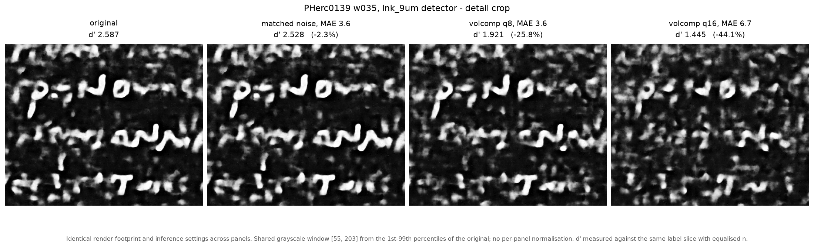

# volcomp-ink-curve

PR [ScrollPrize/villa#1704][pr] advises against running the released models on
volcomp-compressed data. This repository tests that advice on 2.5D ink
detection, at 9.4 um, on two segments of PHerc0139. It holds.



*Same volume, same detector, same render footprint, same grayscale window.
Matched noise is Gaussian noise with the same MAE as volcomp q8.*

## How much it costs

| q | ratio | d' loss (w043) | d' loss (w035) |
|---|---|---|---|
| 2 | ~11x | -2.1 % | -1.0 % |
| 4 | ~17x | -7.2 % | -7.4 % |
| 8 | ~44x | -21.9 % | -25.7 % |
| 16 | ~52x | -44.3 % | -44.1 % |

q = 8 is the published operating point, and costs about a fifth to a quarter of
the detector's separation. q = 2 is free on both segments. The knee sits
between q = 4 and q = 8.

## How much of it is specific to compression

Unstructured Gaussian noise with the same MAE as q = 8, everything else held
identical:

| segment | volcomp q8 | matched noise | ratio |
|---|---|---|---|
| w035 | -25.8 % | -2.3 % | 11.3x |
| w043 | -22.1 % | -9.4 % | 2.3x |

Part of the loss is generic: a released detector degrades under any
perturbation of this magnitude, and on w043 that accounts for roughly 40 % of
it. Part is not: on both segments the codec costs more than matched noise
does, so quantisation is removing structure the detector uses rather than
merely adding error of a given size. The specific fraction varies by segment
and this measurement does not explain why.

## Context

The `volume-compressor` codec ([SuperOptimizer/volume-compressor][vc]) is a 3D
DCT backend that compresses the open-data volumes by roughly 44x. All 39
scrolls are published as compressed shards at
[dl.ash2txt.org/community-uploads/forrest/volcomp/][data], level 0 at q = 8
(confirmed in the array metadata: `codecs[0].configuration.codecs[0] =
{"name": "volcomp", "q": 8.0}`).

The PR states that models not finetuned on compressed data are sensitive to
it, that the released models should not be used on compressed data, and that
finetuning work is underway with the expectation that most of the discrepancy
is recoverable. The sensitivity claim is what this repository tests.

Other figures: [full segment, w035](figures/panel_w035_full.png) ·
[full segment, w043](figures/panel_w043_full.png) ·
[q curves](figures/) · per-level numbers in [`results/`](results/).

<details>
<summary><b>Method</b></summary>

**Material.** PHerc0139, native 9.362 um scan (`20250728140407`), two segments
(w043, w035) using the official meshes. Original volumes from level 0 of the
open-data bucket, validated by reading every chunk. Compressed volumes decoded
from the published shards and re-written as uncompressed zarr v2, so that
original and compressed differ only in codec round-trip.

**Codec control.** A chunk encoded locally at q = 8 matches the published shard
with MAE 0.000 on both segments. The local encoder and the published data are
the same codec; this is not a measurement of a reimplementation.

**Render control.** Our render of the original volume reproduces the official
published render exactly: r = 1.0000 against `w043.zarr` / `w035.zarr` at
offset (39, 39). The `orig` arm is not an approximation of the official surface
volume; it is that volume.

**Detector.** `ink_9um`, hybrid_3d2d-seed43, step 60000. Inference identical
across all volumes: level 0, overlap 0.75, gaussian blend, both directions, 28
slices. Verified deterministic (repeat run: r = 1.000000, MAE 0.0).

**Metric.** d' and median ratio of predicted ink intensity inside vs outside
the label, with equalised n and a permutation null. Same label slice, same
seed, same render footprint for every volume in a round.

**Planted control.** Zero-mean Gaussian noise, MAE matched to each q level,
zeros preserved so the mask and auto-crop stay identical. If unstructured noise
had cost the same as the codec, the curve above would have been measuring
detector fragility rather than information removal.

Matched noise also leaves the median intensity ratio unchanged (2.826 on w035,
identical to the original, up to q = 8), while under volcomp it falls
monotonically, from 2.826 to 2.110 at q = 16.

Full protocol and the sealed record are in [`docs/`](docs/).

</details>

<details>
<summary><b>Caveats</b></summary>

**One detector, one resolution, one scroll.** `ink_9um` is a 2.5D detector at
9.4 um. Nothing here transfers to 3D ink, to surface prediction, or to 2.4 um
work, where ink signal is relief rather than attenuation.

**Not finetuned.** This measures a released detector applied to compressed
volumes. It does not measure what finetuning on compressed data recovers, which
is the work described in the PR.

**Compression ratios differ from the PR's.** Our ratios (11x / 17.8x / 44x /
53.5x for q = 2/4/8/16) are lower than those reported in the PR (17.6x / 30.1x
/ 52.9x / 95.6x). We encode only chunks around the segment surface, which are
dense, while the PR figures cover the full array including large low-entropy
regions. PSNR at q = 8 is close (35.05 dB here, 35.00 dB in the PR), though
both scans and both regions differ, so that agreement is suggestive rather than
a calibration.

**The noise control's factor varies by segment.** An untested hypothesis is
baseline: w043 has diffuse ink signal and a much lower starting d' (1.605 vs
2.587), so any perturbation bites proportionally harder there. At q = 16 the
matched noise also has heavier tails than any volcomp level (P90 14 / P99 22,
against P90 8 / P99 13 at q = 8), making that particular control more
aggressive than needed.

**Inference-footprint instability.** Cropping the same official volume at
(20, 20) instead of (39, 39), with no render and no compression in between,
changes d' from 2.824 to 2.085, a 26 % loss of the same order as q = 8 costs.
Two crops of the same volume produce maps correlating r = 0.72. This does not
affect the curves above, which use an identical footprint across all volumes in
a round, but it does affect any d' comparison across segments or across runs
with different footprints. Documented separately.

**Pre-registration.** The w043 round has a sealed pre-registration. The w035
round inherits its protocol but has none of its own, and three instrument
corrections were made mid-run after seeing data (offset refinement, mesh
orientation, arm selection). The noise control is post hoc. All of this is
declared in the record, along with an erratum showing the corrections shifted
the measured q = 8 loss by under two percentage points.

</details>

<details>
<summary><b>Reproducing</b></summary>

```bash
# decode published shards to uncompressed zarr v2
python transcreve_vc.py

# encode the original at other q levels with the local codec
python codifica_q.py 2 4 16

# render, infer, measure
python mede_volcomp.py
python mede_curva_q.py

# planted control
python faz_ruido.py 3.47 q8
```

Scripts, per-level outputs and sha256 seals: [`scripts/`](scripts/),
[`results/`](results/), [`docs/SHA256SUMS.txt`](docs/SHA256SUMS.txt).

</details>

---

The codec and the compressed volumes are the work of the author of PR
[#1704][pr]; this repository is an independent measurement made on them, by
Paulo Sergio Camillo (pscamillo), 2026-09-08 to 2026-09-10.

Thanks to the codec author for publishing both the codec and the compressed
data openly, and for raising the question about 2.5D ink sensitivity that
prompted this measurement.

[vc]: https://github.com/SuperOptimizer/volume-compressor
[pr]: https://github.com/ScrollPrize/villa/pull/1704
[data]: https://dl.ash2txt.org/community-uploads/forrest/volcomp/
